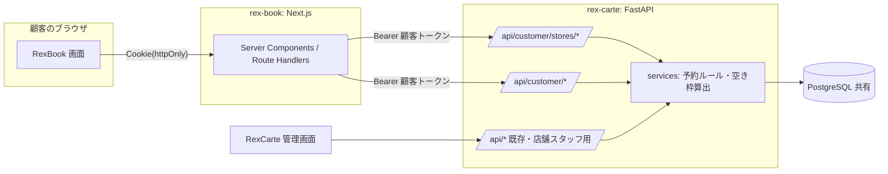
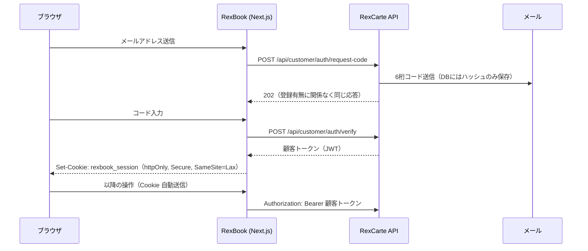

# アーキテクチャ

## 1. 全体構成



- **予約ルールは RexCarte の `services` 層に 1 つだけ持つ。** 店舗スタッフ用 API と顧客用 API は同じ判定関数を呼ぶ。
- RexBook は **BFF（Backend for Frontend）**。ブラウザは RexBook の Next.js とだけ通信し、Next.js のサーバー側が RexCarte API を呼ぶ。
  - 顧客トークンは RexBook ドメインの **httpOnly Cookie** に保存し、ブラウザの JavaScript から読めないようにする（顧客向けは不特定多数が使うため、トークンを画面側のスクリプトから扱わない方式にする）。
  - RexCarte API の URL をブラウザに出さず、CORS 設定も不要になる。

## 2. 技術選定

| レイヤ | 採用 | 理由 |
| --- | --- | --- |
| 顧客向けフロント | Next.js（App Router）/ React / TypeScript | ホーム・予約画面のサーバーレンダリング、Route Handler で BFF を作れる |
| スタイル | Tailwind CSS v4 | RexCarte と揃える |
| フォーム・検証 | Zod | 入力検証を BFF とフォームで共有 |
| サーバー状態 | Server Components で取得。空き枠などの操作系は Route Handler 経由の fetch | クライアント側のキャッシュライブラリを最小限にする |
| API・ルール | RexCarte（FastAPI / SQLAlchemy 2.0 / Alembic） | 既存の予約ルールを再利用 |
| DB | PostgreSQL（RexCarte と共有）。排他制約に `btree_gist` 拡張を使う | 同時予約を DB で防ぐ |
| メール | 本番: Resend、ローカル: Mailpit（SMTP を受けて画面で確認） | 送信実装を差し替え可能にする |
| テスト | RexCarte: pytest、RexBook: Vitest（純粋関数）+ Playwright（E2E） | 判定ロジックはバックエンドで網羅、画面は主要フローのみ |

## 3. 顧客認証

### 3.1 ログインの流れ



### 3.2 トークンの分離（重要）

RexCarte の既存 `get_current_user` は JWT の `sub` を店舗スタッフ（User）の ID として扱う。顧客トークンを誤ってスタッフ用 API に通さないため、以下を必須とする。

- JWT に `typ` クレームを入れる（スタッフ: `staff`、顧客: `customer`）。
- 既存の `get_current_user` はスタッフのトークン以外を 401 にする。
- 顧客用の依存関数 `get_current_customer` は `typ == "customer"` のみ受け付け、`sub` を `CustomerAccount.id` として解決する。
- 顧客トークンの有効期限は 7 日（Cookie も同じ）。ログアウトで Cookie を削除する。

### 3.3 CSRF 対策

- Cookie は `SameSite=Lax`。状態を変える操作（予約確定・キャンセル・ログアウト・コード送信）は Route Handler（`src/app/api/`）のみで受け、`src/lib/bff.ts` の `handleMutation` を必ず通す。そこで次を順に行う。
  1. `Origin` を `APP_URL` と照合（`src/lib/origin.ts`。Origin が無い・別オリジンは 403）
  2. `Content-Type: application/json` の確認（他サイトのフォーム送信では作れないため。違えば 415）
  3. ログインが必要な操作は、入力の検証より先にセッション Cookie を確認（無ければ 401）
  4. Zod による入力検証（フォームと同じスキーマ `src/lib/schemas.ts`）。日本語で書いた文言以外（Zod の英語の既定文言）は共通文言に置き換える
  5. RexCarte のエラーを顧客向けの文言に変換（RexCarte は理由を区別しない共通文言を返すので、文字列ならそのまま通す）

### 3.4 実装上の取り決め

- **コード入力画面へのメールアドレスの受け渡し**: URL に載せず、コード送信時に短時間（10 分）の httpOnly Cookie `rexbook_login_email` に置く。検証に成功したら削除する。この Cookie が無い場合、コード違いと同じ文言（401）にする（理由を区別しない）。
- **戻り先（`?next=`）**: `src/lib/navigation.ts` の `safeNextPath` で、このアプリ内の相対パスだけを許可する（外部サイトへ飛ばされるオープンリダイレクト、`//host`、バックスラッシュ、制御文字、`/api`・`/login` を拒否）。
- **ログイン切れ**: 顧客トークンと Cookie は同じ 7 日で切れる。トークンが無効になった場合は、Server Component から Cookie を消せないため、ログイン画面へ戻り先付きで誘導し、ログインし直すと上書きされる（`requireAccount`）。ループしないよう、ログイン画面は Cookie の有無で遷移させない。
- **接続元 IP の転送**: BFF から呼ぶと全利用者が BFF の 1 つの接続元に見えるため、`rexcarte.ts` は利用者の接続元を RexCarte に転送する。本番では、RexCarte 側で BFF を信頼できる送信元として設定する（利用者ごとの回数制限を正しく効かせるため）。
- **先読みしない**: 予約の画面は空き枠などを毎回 RexCarte に問い合わせ、店舗・空き枠 API にはアカウント単位の回数制限があるため、`AppLink`（`src/components/ui.tsx`）は `prefetch` を無効にしている。
- **動的レンダリング**: 全ルートがリクエスト時に描画される（`cookies()` や `connection()` を使う）。空き枠・予約は常に最新でなければならず、ビルド時に固定しない。
- **セキュリティヘッダー**: `next.config.ts` で `X-Frame-Options: DENY`・`X-Content-Type-Options: nosniff`・`Referrer-Policy: same-origin`（URL のクエリに予約の選択内容があるため、外部へ Referrer を送らない）。

## 4. ディレクトリ構成（rex-book）

```
rex-book/
├─ docs/                          設計ドキュメント
├─ src/
│  ├─ app/
│  │  ├─ page.tsx                 予約トップ（お名前と予約ボタン・今後のご予約・予約カレンダー・マイチケット）
│  │  ├─ stores/[storeId]/
│  │  │  ├─ page.tsx              店舗情報
│  │  │  └─ book/                 予約ステップ（チケット→日時（担当を含む）→確認）。ステップごとの
│  │  │     ├─ page.tsx             Server Component は _components/、チケットの解決は _lib/
│  │  │     ├─ _components/
│  │  │     └─ _lib/
│  │  ├─ login/ (verify/)         メール入力・コード入力
│  │  ├─ reservations/[id]/       予約詳細（キャンセル・予約完了の表示）
│  │  ├─ branding/icon/           事業者のアイコン画像を RexCarte から取って返す（ヘッダー用・認証なし）
│  │  └─ api/                     BFF の Route Handler
│  │     ├─ auth/{request-code,verify,logout}/
│  │     └─ reservations/ ([id]/cancel/)
│  ├─ lib/
│  │  ├─ rexcarte.ts               RexCarte API クライアント（サーバー専用）
│  │  ├─ session.ts               Cookie の読み書き（サーバー専用）
│  │  ├─ auth.ts                  ログイン必須画面の共通処理 requireAccount（サーバー専用）
│  │  ├─ bff.ts                   Route Handler 共通処理 handleMutation（サーバー専用）
│  │  ├─ loaders.ts               店舗・保有チケットの取得（サーバー専用）
│  │  ├─ client-api.ts            ブラウザから BFF を呼ぶ関数
│  │  ├─ schemas.ts               入力検証の Zod スキーマ（フォームと BFF で共有）
│  │  ├─ env.ts                   環境変数の検証（Zod）
│  │  ├─ booking.ts               予約ステップの URL 状態（純粋関数）
│  │  ├─ calendar.ts / tickets.ts  カレンダーの日付計算・保有チケットのまとめ方（純粋関数）
│  │  ├─ navigation.ts / origin.ts / hours.ts / format.ts / reservations.ts / datetime.ts / types.ts
│  └─ components/                 共通 UI・PageShell・ログイン/コード等のフォーム
├─ tests/
│  ├─ unit/
│  └─ e2e/
├─ Dockerfile                     お試し起動用
├─ docker-compose.yml
└─ .env.example
```

## 5. 環境変数（rex-book）

| 変数 | 例（ダミー） | 用途 |
| --- | --- | --- |
| `REXCARTE_API_URL` | `http://localhost:8000` | BFF から呼ぶ RexCarte API（Docker 内では `http://host.docker.internal:8000` など） |
| `SESSION_COOKIE_SECURE` | `false` | ローカルのみ false、本番は true |
| `APP_URL` | `http://localhost:3100` | メール本文のリンク・Origin 検証 |

RexCarte 側の変数（顧客トークンの有効期限、メール送信設定など）は RexCarte の `backend/.env.example` と README を参照。

## 6. ローカル実行

- RexCarte を `docker compose --profile app up` で起動した状態で、RexBook を `docker compose --profile app up` で起動する（ポート 3100）。
- メールは RexCarte の compose に追加する Mailpit（http://localhost:8025）で確認する。
- パッケージマネージャーは npm（RexCarte の frontend と揃える）。ネイティブ開発（`npm run dev`）の手順も README に併記する。

## 7. 本番環境の構成

ホスティング先ごとのデプロイ構成（インフラ定義など）は本リポジトリに含めず、導入先の環境に合わせて設定する。Next.js の標準的なホスティングであれば構成を変更できる。DB は RexCarte と同一の PostgreSQL への接続を前提とする（`sslmode=require` 等は接続先に合わせて設定）。メールは `MAIL_BACKEND` の切り替えで送信サービスを差し替えられる（RexCarte の README を参照）。
