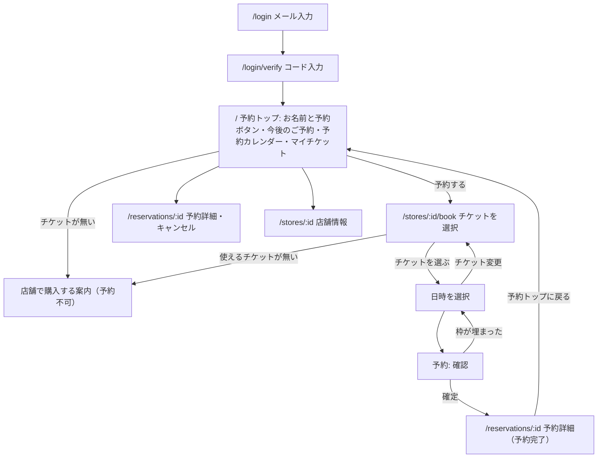

# 画面一覧・遷移

- スマートフォン幅（375px〜）を基準に設計し、PC では中央寄せの 1 カラム。
- **ログインしていないと、ログイン画面以外は何も表示しない**（店舗・チケット・空き枠も含む）。未ログインで開くと `/login?next=…` へ誘導する。ログインできるのは、店舗に顧客として登録済みの人だけ。
- 予約ステップの状態は URL のクエリ（`?plan=…&staff=…&date=…&time=…`）に持たせ、ブラウザの戻る操作・リロードで失われないようにする。
- 予約・保有チケット・予約状況は店舗ごと。複数の店舗に登録されている場合は、セレクターで店舗を切り替える。

## 1. 画面遷移

## 2. 画面別仕様

### 2.1 `/` 予約トップ 🔒

ログイン後の最初の画面。このアプリの主役は予約なので、予約の入口と現在の予約状況を並べる。上から次の順。

- ヘッダー: **導入先の事業者名とアイコン**（RexCarte の事業者設定。予約トップへのリンク。未設定なら「RexBook」）とログアウトだけ。ログイン・コード入力の画面にも事業者名・アイコンを出す。全画面共通で、お名前やマイページは出さない。
- 複数の店舗に登録されている場合は、いちばん上に店舗のセレクター（`?store=`）。予約状況は選んだ店舗の分。
1. **お名前（「〇〇 さん」）と、その右に大きめの「予約する」ボタン**（高さ 56px 以上。左に「＋」アイコン）。使えるチケットが無い場合は、ボタンを出さず、下に「ご利用いただけるチケットがありません。ご予約にはチケットが必要です。〇〇店でご購入いただくと、こちらからご予約いただけます」の案内（店舗の電話番号つき）を出す。お名前・電話番号が店舗に未登録の場合も予約できず、「店舗へお問い合わせください」の案内を出す。
2. **今後のご予約**: 正方形のカード（日付・時刻・チケット名・担当）を**横スクロール**で並べる（画面に 2〜3 枚が見える幅）。カードから予約詳細・キャンセルへ。ない場合は「今後のご予約はありません」。
3. **予約カレンダー**（`?month=YYYY-MM`、`?date=YYYY-MM-DD`）: 日曜始まりの月カレンダー。予約（確定・来店済み）のある日に ● と件数（今後はワインレッド・過去は灰、色だけでなく記号・読み上げ用の文字でも示す）、今日は枠線。凡例は「● 今後の予約　● 過去の予約」（● はワインレッド・灰）。予約のある日を押すと、その日の予約カードが**カレンダーの枠の中、日付の表のすぐ下**に出る（押した結果が画面の外に隠れないようにする）。移動できる月は、今日の月から 2 か月先まで＋予約のある月。過去の予約は、ここで過去の月へ戻って見る。
4. **マイチケット**: 1 枚 1 カード。チケット名と「3/8（有効期限 2026/12/20）」（3 = 予約に使える回数、8 = 購入時の回数。有効期限がなければ「3/8」）。単発・回数券の区別は表示しない。
- **過去のご予約**（折りたたみ。初期は閉じる。見出しに件数）: 終わった予約・キャンセルした予約・無断キャンセルを新しい順に。**件数が増えても長くならないよう 10 件ずつ表示し、「さらに 10 件表示（10/35件）」を押すと増える**（`?past=20` のように URL に持つので、押したあとも開いたまま。カレンダーを動かしても開いたまま）。
- いちばん下に「店舗情報（住所・電話・営業時間）」へのリンク。
- 顧客として登録されている店舗が 0 件なら「ご利用いただける店舗がありません。店舗へお問い合わせください」。

**マイページは持たない**: 今後・過去の予約は予約トップ（今後のご予約・予約カレンダー）と同じ内容で冗長なため、廃止した。プロフィールは店舗が管理し、お客様自身では変更できない（§2.6）ので編集画面も不要。ログアウトはヘッダーに置く。キャンセル済み・無断キャンセルの過去の予約は「過去のご予約」の折りたたみに入る。

### 2.2 `/stores/[storeId]` 店舗情報 🔒

- 店舗が複数ある場合は、上部に店舗のセレクター。
- 店舗名・住所・電話番号（タップで発信）・曜日ごとの営業時間。「予約する」ボタン（予約 §2.3 の「チケットを選択」へ）。
- 予約の選択肢（チケット）はここには置かない。予約に必要なものはホームと予約画面にある。

### 2.3 `/stores/[storeId]/book` 予約ステップ 🔒

1 ページ内でステップを切り替える（上部にステップ表示。3 ステップ）。店舗が複数ある場合は上部に店舗のセレクター。

| ステップ | 内容 |
| --- | --- |
| 1. チケット（画面の見出し: 「チケットを選択」） | 持っているチケットを、同じプランごとに 1 行で並べる（チケット名・所要時間・「3/8（有効期限 2026/12/20）」）。各行に「選ぶ ›」のボタン風の目印、選び直しのときは現在の選択が「選択中」。**予約ボタンからは必ずこの画面から始まる**（チケットが 1 つだけでも自動では選ばない）。**使えるチケットが無い場合は、店舗で購入する案内だけを出す**（予約できない）。選び直しても日付・担当は引き継ぐ |
| 2. 日時（見出し: 「日時を選択」） | 「ご利用のチケット」と「チケット変更」ボタン → **担当**（指名なし＝既定 / 指名できるスタッフ。選択状態は ✓ と色で示す）→ **日付**（今日から 2 週間分のタブ。予約できる時刻がない日はグレーで選択不可）→「カレンダーで先の日付を選ぶ」→ **時刻**ボタンの一覧。時刻がない場合は「予約できる時刻がありません」とだけ表示（理由は出さない） |
| 3. 確認（見出し: 「予約内容の確認」） | 店舗・チケット・担当（指名なしの場合は「指名なし」と表示し、担当者名は予約完了画面で表示）・日時・ご利用（「チケット 1 回分」。回数券は予約後の予約に使える回数も）・キャンセル期限・店舗へのご要望（任意、500 文字まで）→ 「予約を確定する」を押すと、**確定の前に「この内容で予約を確定します。よろしいですか？」と確認**を出し、「確定する」で初めて予約する（「戻る」で閉じる。Enter キーでも確認が出るだけ）。「戻る」（画面左上）は 確認 → 日時 → チケット選択 → 予約トップ の順。予約開始まで期限（既定 24 時間）に満たない直前の予約は、確定後に顧客自身ではキャンセルできないため、期限の時刻の代わりに「ご予約日が近いため、確定後のキャンセルは店舗へお電話ください」と表示する。選んだ枠が空いていなければ「この時間は予約できなくなりました」と日時の選び直しを案内する。お名前・電話番号が店舗に未登録なら、予約せず「店舗へお問い合わせください」と案内する |

**スクロール位置**: 日時の画面で担当・日付・カレンダーの月を切り替えても、スクロール位置は先頭に戻さない（見ていた場所のまま内容だけ入れ替わる）。時刻を選んで確認へ進むときと、チケットを選び直すときは、通常どおり先頭へ移動する。

**カレンダー**（日時の画面で開く。`?cal=YYYY-MM`）

- 月カレンダー（日曜始まり）。予約できる日だけがリンク（色つき）で、そうでない日・予約できる期間の外の日は選べない（読み上げにも「予約できる時刻がありません」と出す）。選択中の日は ✓ つき。
- 移動できる月は、今日の月から「予約できる最後の日（今日 + 予約できる先の期間、既定 60 日）」の月まで。前の月・次の月へ移動するリンク、「カレンダーを閉じる」。
- 日付を選ぶとカレンダーは閉じ、その日の時刻が並ぶ（「カレンダーで選んだ日の時刻を表示しています」）。
- 表示する月の空き状況は、その月のうち予約できる期間に含まれる範囲を RexCarte の空き枠 API（日付ごとの可否）に 1 回だけ問い合わせる。

- 確定で 409 が返ったら「この時間は予約できません。別の日時をお選びください」と表示し、日時の選び直しを案内する。

### 2.4 予約完了

- 予約番号（予約 ID の先頭 8 桁）・日時・担当者名・キャンセル期限。「確認メールを送信しました」。
- 「予約トップに戻る」。
- 実装: 専用の画面は持たず、予約詳細（`/reservations/[id]?done=1`）に成功メッセージを重ねて表示する。確定状態のときだけ出す（同じ URL のままキャンセルしたら消える）。

### 2.5 `/login` / `/login/verify`

- 「店舗にご登録のメールアドレス」を入力 → 「登録されているメールアドレスの場合、ログインコードを送信しました」（**登録有無・送信の有無で文言を変えない**。未登録には実際には送らない）。「コードが届かない場合は、ご登録のメールアドレスをご確認のうえ店舗へお問い合わせください」と案内する。
- 6 桁コード入力（数字キーボード、1 つの入力欄）。「コードを再送する」は 60 秒後から押せる。
- 失敗時は「コードが正しくないか、有効期限が切れています」で統一（未登録のメールアドレスの場合も同じ）。

### 2.6 プロフィール（画面なし）

- お名前・フリガナ・電話番号は**店舗が顧客レコードで管理し、お客様自身では変更できない**（画面・API とも持たない）。ログインのたびに、店舗の顧客レコードの内容に揃う。
- 電話番号（またはお名前）が店舗に未登録の顧客は、ログインはできるが予約できない。予約トップ・確認画面で店舗への問い合わせを案内する。

### 2.7 `/reservations/[id]` 🔒 予約詳細

- 予約内容。キャンセル期限内なら「予約をキャンセルする」（2 段階の確認）。
- 期限後は「キャンセル期限を過ぎています。店舗へお電話ください」と電話番号。
- 画面の下に「予約トップに戻る」だけを置く（マイページ・店舗ページへのリンクは持たない）。

## 3. 共通

| 要素 | 方針 |
| --- | --- |
| 配色 | ブランドカラーは**ローズゴールド → ワインレッドの 2 色**（`globals.css` の `rosegold-*` と `wine-50`〜`wine-900`。基準色はワインレッドの 700）。背景は明るい暖色の白で、面は白。黒・濃色を面の主役にしない。主要な操作（予約ボタン）・選択中の状態（日付・時刻・担当・ステップ・カレンダーの選択日）は `wine-gradient`（ローズゴールド → ワインレッドのグラデーション。ヘッダーの事業者名は同じ色の `wine-gradient-text`）で力強く示す。ヘッダーは白で、下端にグラデーションの細い線。文字のフォントは変えない（システムの和文フォント） |
| ヘッダー | 事業者名・アイコン（予約トップへのリンク。RexCarte の事業者設定）、ログイン中はログアウト。お名前は出さない（ログイン・コード入力画面にはログアウトを出さない） |
| 日時表記 | `2026年10月1日(木) 10:00〜11:00`（JST） |
| 料金 | 現状は表示しない（チケットは店頭で購入済みのため）。オンライン購入の導入時に、税込表記の円で表示する |
| エラー | 通信エラーは「時間をおいて再度お試しください」。予約ルール違反は RexCarte が返す共通の文言（予約できない理由を区別しない）。使えない店舗・存在しない予約は「ページが見つかりません」（区別しない） |
| アクセシビリティ | 時刻・日付・担当のボタンは十分なタップ領域（44px 以上）。選択状態・選べない状態を色だけで表さない（✓・文字・aria） |
